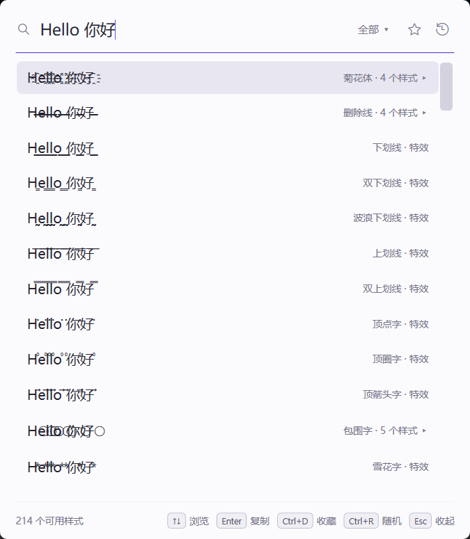
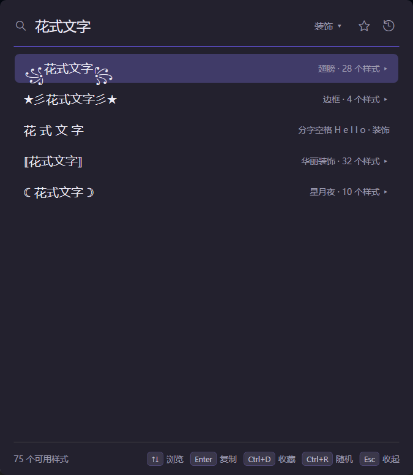

# 花式文字 FancyText

> 一个随叫随到的花式文字转换器。

想给昵称加一对翅膀、把签名换成花体，或者发一句菊花体逗逗朋友，难的不是效果，而是**每次都得重新去找**：打开浏览器搜「花式字体生成器」，在满屏广告里找到输入框，复制出来一半是方块；菊花体、火星文、拼音还得各找各的网站。

FancyText 应运而生——在任何地方选中一段文字，按下 `Ctrl+Alt+F`，选中的内容自动带进来，130 种样式一屏排开，边打字边预览；挑中一个按 `Enter`，结果就在剪贴板里了。菊花体、魔鬼文字、花藤体、𝓕𝓪𝓷𝓬𝔂 花体、火星文、简繁转换、拼音，都在同一个窗口里。

它也很在意**轻**。一个整天挂在托盘里的小工具，最好让人感觉不到它的存在。所以弹窗一收起，它就把界面用过的内存还给系统，任务管理器里只剩几 MB；不用安装，解压出一个 exe 就能用，也不需要另装 .NET。

<p>
  
  
</p>

外观跟着 Windows 走：Win11 的 Mica 半透明材质，深浅色和强调色随系统切换，动画也听系统「动画效果」开关的。不合口味的地方都能改：主题、强调色、预览字号、弹窗位置、快捷键，嫌动画多还能一键全关。

> C# + .NET 10 + WPF，零第三方依赖。「几 MB」是收起 1.5 秒后任务管理器显示的工作集；唤出时约 60–110 MB，提交内存约 150 MB，实测表见[操作手册](docs/操作手册.md#性能实测)。

## 下载与上手

1. 从 [Releases](https://github.com/Traveritas/fancytext/releases) 下载 `FancyText.Desktop-x.y.z-win-x64.zip`，解压到任意文件夹，双击 `FancyText.Desktop.exe`。托盘出现图标即就绪。
2. 在任意程序里选中一段文字，按 `Ctrl+Alt+F` 唤出；没选中就直接打字。
3. `↑↓` 挑样式，`Enter` 复制并收起，回到原处粘贴。

系统要求：Windows 10 / 11 x64（Win11 效果最佳）。

## 功能

- **快转**：边打字边预览全部样式，对当前文字不适用的自动隐藏；`Enter` 复制的是全文结果。`Ctrl+R` 随手抽一个
- **选中即预填**：唤出的同时在后台读取其它程序里选中的文字，不动剪贴板；读不到的程序可以开「兼容模式」用模拟复制兜底
- **家族折叠**：翅膀、删除线、菊花体、边框这类成群的样式折成一行，`→` 钻进去挑、`←` 退出来，列表不会一眼望不到头
- **收藏与最近**：`Ctrl+D` 收藏常用的；⭐ / 🕘 一键切到收藏或最近用过的
- **分类筛选**：特效、英文花体、装饰、变换、中文、编码六类，`Tab` 开菜单，`Ctrl+Tab` 轮着切
- **样式包**：样式是纯数据，一个包就是一个 `.json` 文件。内置 4 个官方包一键安装（华丽装饰、叠加特效、颜文字、星月夜），也能从[在线索引](https://github.com/Traveritas/fancytext-styles)获取更多；想要新样式，把[样式包规范](docs/样式包规范.md)丢给 AI 让它写一个
- **不出豆腐块**：内置字体覆盖，组合符自动找到系统里能显示它的字体，免配置
- **设置**：中 / 英界面、主题与强调色（可跟随系统）、预览字号、减少动效、快捷键录制、开机自启、预填选项、复制后收起、弹窗位置
- **命令行**：源码里还有一个 `fancy` 命令行工具，脚本里也能转换（不在发布包里，构建方法见操作手册）

完整快捷键和操作说明见 [操作手册](docs/操作手册.md)。

## 常用快捷键

焦点始终在输入框里，从唤出到复制不用碰鼠标。唤出键可以在「设置 → 快捷键」里重新录制。

| 按键 | 作用 |
|---|---|
| `Ctrl+Alt+F` | 唤出弹窗 |
| 直接打字 · `↑↓` | 实时预览 · 选样式 |
| `Enter` | 复制全文并收起（在族条目上 = 钻入） |
| `→` / `←` | 钻入家族 / 返回上一级 |
| `Ctrl+D` · `Ctrl+R` | 收藏 · 随机选一个 |
| `Tab` · `Ctrl+Tab` | 打开筛选菜单 · 切换筛选 |
| `Esc` | 逐层退出（菜单 → 钻取 → 收起弹窗） |

## 数据存放与卸载

程序本身就是一个 exe；设置和数据放在 `%LOCALAPPDATA%\FancyText\`：`desktop.json`（设置）、`state.json`（收藏、最近）、`styles\`（已装的样式包）。

- **迁移**：拷走 exe，再把这个文件夹拷到新电脑的同一位置。
- **卸载**：先在设置里关掉「开机自启动」（它会写一条 `HKCU\...\Run` 注册表项），托盘右键退出，再删掉 exe 和 `%LOCALAPPDATA%\FancyText\`。

## 从源码构建

需要 .NET SDK 10：

```
tools\package.ps1
```

产物是 `dist\FancyText.Desktop-x.y.z-win-x64.zip`。跑引擎测试：`dotnet run --project tests/FancyText.Core.Tests`。

## 仓库结构

```
src/FancyText.Core/      转换引擎：声明式样式管道、映射表、词典、样式包
src/FancyText.Desktop/   桌面版（WPF：托盘 + 全局热键 + 弹窗）
src/FancyText.Cli/       命令行工具 fancy
tests/                   引擎测试 + demo / bench / audit 子命令
tools/                   打包、图标与 UI 验证脚本
docs/                    操作手册、样式包规范、示例包、设计稿、品牌图；archive/ 是早期调研存档
```

源码分工、性能实测和构建细节见 [操作手册](docs/操作手册.md)。

## 许可

代码以 [MIT 许可证](LICENSE) 发布。

内嵌的火星文字典（[cnchar](https://github.com/theajack/cnchar)，MIT）、简繁词表（[OpenCC](https://github.com/BYVoid/OpenCC)，Apache-2.0）和拼音数据（[pinyin-data](https://github.com/mozillazg/pinyin-data)，MIT）归各自作者所有，许可全文见 [THIRD-PARTY-NOTICES.md](THIRD-PARTY-NOTICES.md)。
